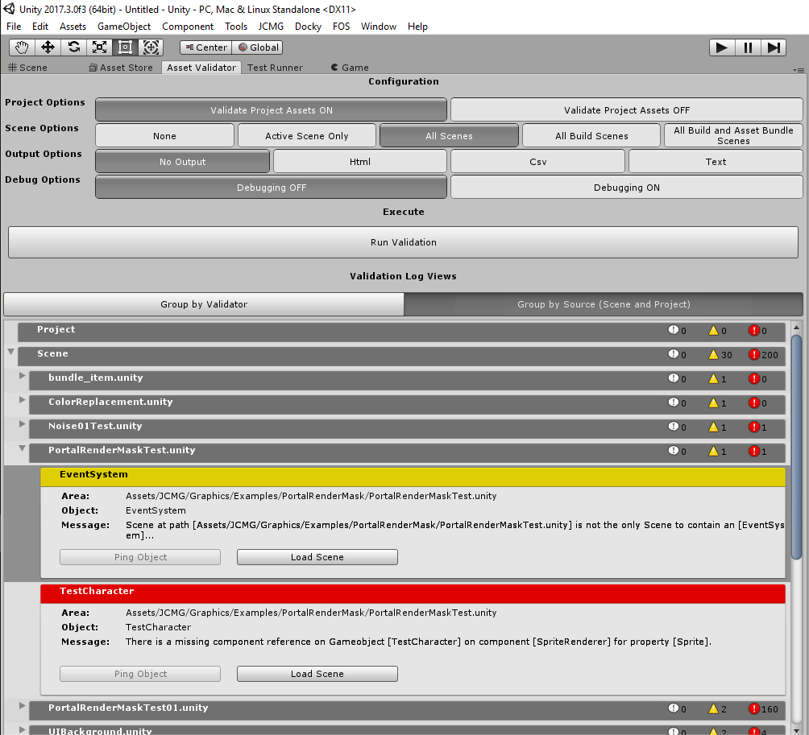

# Asset Validator
The official repository for Asset Validator, an editor tool for validating assets in the project and in scenes.

**NOTE:** _I have archived this as I've personally adopted the OdinValidator tool found [here](https://odininspector.com/odin-project-validator) in serving the same role. If anyone is interested in adopting this and continuing on, feel free!_ 

- _ Jeff Campbell _



## Overview
The AssetValidator is an editor tool for validating scenes and assets. It makes substantial use of C# Reflection to infer which types should be validated and in which context.

## Importing JCMG Asset Validator
Using this library in your project can be done in two ways:
* **Releases:** The latest release can be found [here](https://github.com/jeffcampbellmakesgames/unity-asset-validator/releases) as a UnityPackage file that can be downloaded and imported directly into your project's Assets folder.
* **Package:** Using the native Unity Package Manager introduced in 2017.2, you can add this library as a package by modifying your `manifest.json` file found at `/ProjectName/Packages/manifest.json` to include it as a dependency. See the example below on how to reference it.

```
{
    "dependencies": {
        ...
        "com.jeffcampbellmakesgames.assetvalidator" : "https://github.com/jeffcampbellmakesgames/unity-asset-validator.git#release/stable"
        ...
    }
}
```

## Contributors
If you are interested in contributing, found a bug, or want to request a new feature, please see [here](./contributors.md) for more information.

## Unity Editor Compatibility
Greater than or equal to 2017.4.X LTS

## Roadmap
The roadmap for this project can be seen on the public trello board found here: https://trello.com/b/hDEXoZ7G

## License
MIT License

Copyright (c) 2019 Jeff Campbell

Permission is hereby granted, free of charge, to any person obtaining a copy
of this software and associated documentation files (the "Software"), to deal
in the Software without restriction, including without limitation the rights
to use, copy, modify, merge, publish, distribute, sublicense, and/or sell
copies of the Software, and to permit persons to whom the Software is
furnished to do so, subject to the following conditions:

The above copyright notice and this permission notice shall be included in all
copies or substantial portions of the Software.

THE SOFTWARE IS PROVIDED "AS IS", WITHOUT WARRANTY OF ANY KIND, EXPRESS OR
IMPLIED, INCLUDING BUT NOT LIMITED TO THE WARRANTIES OF MERCHANTABILITY,
FITNESS FOR A PARTICULAR PURPOSE AND NONINFRINGEMENT. IN NO EVENT SHALL THE
AUTHORS OR COPYRIGHT HOLDERS BE LIABLE FOR ANY CLAIM, DAMAGES OR OTHER
LIABILITY, WHETHER IN AN ACTION OF CONTRACT, TORT OR OTHERWISE, ARISING FROM,
OUT OF OR IN CONNECTION WITH THE SOFTWARE OR THE USE OR OTHER DEALINGS IN THE
SOFTWARE.
