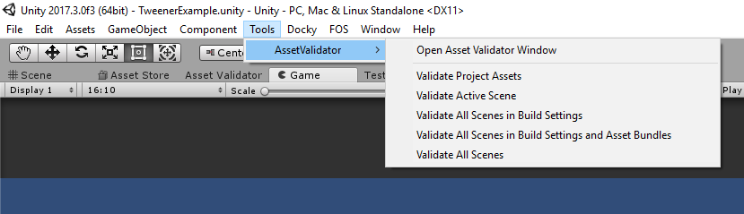

# Asset Validator
The official repository for Asset Validator, an editor tool for validating assets in the project and in scenes.

**Last Updated:** 1/25/2018 4:46 PM


## Unity Editor Compatibility
Tested on versions 5.2.2f1 through 2017.3.0f3

## Roadmap
The roadmap for this project can be seen on the public trello board found here: https://trello.com/b/hDEXoZ7G

## Overview
The AssetValidator is an editor tool for validating scenes and assets. It makes substantial use of C# Reflection to infer which types should be validated and in which context. It offers several different base validator types to help handle different types of scenarios for validating assets as well as a library of existing validators.

* **Field Validators:** A validator derived from ```BaseFieldValidator``` that uses a specific ```FieldTargetAttribute``` derived class to target a public or private instance field on a ```Monobehavior``` or ```ScriptableObject```. It can target instances in a scene or on a prefab in the project. In order for a Field Validator to discover ```Monobehavior``` or ```ScriptableObject``` derived types for validation, they must have a ```[Validate]``` attribute present.

* **Object Validators:** A validator derived from ```BaseObjectValidator``` that uses a specific ```ObjectTargetAttribute``` subclass to target a ```Monobehavior``` or ```ScriptableObject``` derived class. It can target instances in a scene or on a prefab in the project. As long as the appropriate ```ObjectTargetAttribute``` is present, the validator can discover these types in Scene(s) and prefabs in the project

* **Cross Scene Validators:** A validator derived from ```BaseCrossSceneValidator``` used to aggregate information across one or more scenes using a ```Search()``` method fired once per scene and then fires a ```Validate()``` method at the end of searching all target scenes to validate based on the results. No attributes are directly used for Cross Scene Validators.

* **Project Validators:** A validator derived from ```BaseProjectValidator``` that can be fired once against the project using its ```Validate()``` method and validate assets and/or settings in the project. No attributes are directly used for Project Validators

## Usage
To run the validators manually, there are a couple of options for doing so:
* **Dedicated Window**: By selecting the menu items "Window->Asset Validator" or by selecting "Tools->Asset Validator->*" you can either launch a window with options for configuring and executing validators and then manually run, or run validation through a pre-configured menu item option. Here are several such options:


  * **Validate Project Assets:** All Project, Field, and Object validators will be run on assets in the Asset project folder.

  * **Validate Active Scene:** All Field and Object validators will be run against the currently open scene; Cross Scene validators will also be run with only the currently open scene in scope.

  * **Validate All Scenes in Build Settings:** All Cross Scene, Field and Object validators will be run against all scenes in the build settings

  * **Validate All Scenes in Build Settings and Asset Bundles:** All Cross Scene, Field and Object validators will be run against all scenes in the build settings and any scenes that are included in Asset Bundles.

* **Continuous Integration**: Using the ```AssetValidatorCI``` class it is possible to configure a validation run as a unit test which will run in an automated process. Examples of this can be found in the ```AssetValidatorCIExamples``` test class which demonstrates ways in which to fail the unit test when there are validation errors and how to output the results to an plaintext, csv, or html log.
```csharp
/// <summary>
/// These are examples of how to run the AssetValidatorCI either as a part of a Continuous Integration process
/// or as part of Unit tests in the project.
/// </summary>
[TestFixture]
public class AssetValidatorCIExamples
{
    [Test]
    [Ignore("This is an example of how to run the AssetValidator only on Project Assets" +
            "as a Unit Test or CI process.")]
    public void RunAssetValidatorOnProjectAssetsOnly()
    {
        var result = AssetValidatorCI.RunValidation(SceneValidationMode.None, 
                                                    OutputFormat.None, 
                                                    doValidateProjectAssets:true);

        Assert.True(result.isSuccessful, result.message);
    }

    [Test]
    [Ignore("This is an example of how to run the AssetValidator on Project Assets and on Build and AssetBundle Scenes" +
            "and write out the results to a datetime formatted html log as a Unit Test or CI process.")]
    public void RunAssetValidatorOnProjectAssets_BuildAndAssetBundleScenes()
    {
        var loggerFileName = string.Format("asset_validator_results_{0:h_mm_ss_MM_dd_yyyy}", DateTime.Now);
        var result = AssetValidatorCI.RunValidation(SceneValidationMode.AllBuildAndAssetBundleScenes, 
                                                    OutputFormat.Html,
                                                    doValidateProjectAssets:true,
                                                    fileName: loggerFileName);

        Assert.True(result.isSuccessful, result.message);
    }
}
```

## Validators
These are valididators currently available for use in the project, organized by type.

### Field Validators

* **IsProjectReferenceValidator:** Uses the ```[IsProjectReference]``` field attribute to ensure that the assigned reference is not null and refers to an asset in the project and not an instance in the scene.

```csharp
/// <summary>
/// ProjectReferenceComponent is a Monobehavior derived class that has been marked as a [Validate]
/// target. All instances of ProjectReferenceComponent will be found in any scenes searched and in the 
/// project on prefabs if searched. Any fields with [IsProjectReference] will be checked to ensure they
/// are not null and that the Object it refers to is a project asset.
/// </summary>
[Validate]
public class ProjectReferenceComponent : MonoBehaviour
{
    [IsProjectReference]
    public GameObject projectReferenceObject;
}
```

* **IsSceneReferenceValidator:** Uses the ```[IsSceneReference]``` field attribute to ensure that the assigned reference is not null and refers to an asset in the scene and not an instance in the project.

```csharp
/// <summary>
/// SceneReferenceComponent is a Monobehavior derived class that has been marked as a [Validate]
/// target. All instances of SceneReferenceComponent will be found in any scenes searched and in the 
/// project on prefabs if searched. Any fields with [IsSceneReference] will be checked to ensure they
/// are not null and that the Object they refer to are in the same scene.
/// </summary>
[Validate]
public class SceneReferenceComponent : MonoBehaviour
{
    [IsSceneReference]
    public GameObject sceneReferenceObject;
}
```

* **NonNullValidator:** Uses the ```[NonNull]``` field attribute to ensure that the assigned reference is not null.

```csharp
/// <summary>
/// NonNullFieldComponent is a Monobehavior derived class that has been marked as a [Validate]
/// target. Any fields of [NonNull] on it will be checked to see if it has a null value. If the 
/// value of the field checked is null, a validation error will be dispatched. 
/// </summary>
[Validate]
public class NonNullFieldComponent : MonoBehaviour
{
    [NonNull]
    public GameObject nullFieldExample;
}

```

* **ResourcePathValidator:** Uses the ```[ResourcePath]``` field attribute to ensure that the ToString result from this field results in a referenceto an object that could be loaded from the Resources folder using Resources.Load.

```csharp
/// <summary>
/// ResourcePathComponent is a Monobehavior derived class that has been marked as a [Validate]
/// target. Any fields of [ResourcePath] on it will be used in an attempt to load an object from
/// the project using Resources.Load where the path will be the result of the ToString method of
/// the field value.
/// </summary>
[Validate]
public class ResourcePathComponent : MonoBehaviour
{
    [ResourcePath]
    public string resourcePath;

    [ResourcePath]
    public ResourcePathObjectExample resourcePathObject = new ResourcePathObjectExample()
    {
        folder = "hero_icon",
        item = "warrior_icon"
    };
}

/// <summary>
/// When a [ResourcePath] is used on an object, its ToString method will be used to
/// get the resource path to be validated
/// </summary>
public class ResourcePathObjectExample
{
    public string folder;
    public string item;

    public override string ToString()
    {
        return string.Format("{0}/{1}", folder, item);
    }
}

```

### Object Validators

* **HasComponentValidator:** Uses the ```[RequireComponent]``` class attribute to ensure a required component's presence either on this object directly, on a parent or child object, or a combination thereof (i.e, on this object or on a child).

```csharp
/// <summary>
/// HasComponentExampleChild is a Monobehavior derived class that has been marked as a [Validate]
/// target due to [HasComponent] (a subclass attribute of [Validate]). All instances of HasComponentExampleChild 
/// will be found in any scenes searched and in the project on prefabs if searched. If the HasComponent type
/// (in this case HasComponentExampleParent) is not found either on the object or on a parent object a validation error
/// will be dispatched.
/// </summary>
[HasComponent(typeof(HasComponentExampleParent), false, true)]
public class HasComponentExampleChild : MonoBehaviour
{

}

/// <summary>
/// HasComponentExampleA is a Monobehavior derived class that has been marked as a [Validate]
/// target due to [HasComponent] (a subclass attribute of [Validate]). All instances of HasComponentExampleParent 
/// will be found in any scenes searched and in the project on prefabs if searched. If the HasComponent type
/// (in this case HasComponentExampleChild) is not found either on the object or on a child object a validation error
/// will be dispatched.
/// </summary>
[HasComponent(typeof(HasComponentExampleChild), true)]
public class HasComponentExampleParent : MonoBehaviour
{

}
```

* **ZeroChildrenValidator:** Uses the ```[ZeroChilden]``` class attribute to ensure that the Gameobject has zero children.

```csharp
/// <summary>
/// ZeroChildrenComponent is a Monobehavior derived class that has been marked as a [Validate]
/// target due to [ZeroChilden] (a subclass attribute of [Validate]). All instances of ZeroChildrenComponent 
/// will be found in any scenes searched and in the project on prefabs if searched. If any child gameobjects
/// are found on the ZeroChildrenComponent instance, a validation error will be dispatched.
/// </summary>
[ZeroChilden]
public class ZeroChildrenComponent : MonoBehaviour
{

}

```

### Cross Scene Validators

* **EnsureComponentIsUniqueValidator<T>:** This validator should be derived from where there should only ever be one instance of a component present in the scenes searched.

```csharp
/// <summary>
/// FooComponent is a Monobehavior derived component. There should only be 
/// one FooComponent for any of the scenes searched.
/// </summary>
public class FooComponent : MonoBehaviour
{

}

/// <summary>
/// This is a subclass of EnsureComponentIsUniqueValidator; as the generic type is of FooComponent,  
/// when this validator searches across one or more scenes, if it finds more than one instance of 
/// FooComponent a validation warning will be dispatched per instance and an error noting that there 
/// should only be one instance.
/// </summary>
public class EnsureFooComponentIsUniqueValidator : EnsureComponentIsUniqueValidator<FooComponent>
{
        
}

```

* **MissingReferenceValidator:** Checks one or more Scenes to see if there are any missing Component references on every Gameobject and and their SerializedProperties in that scene.

* **MultipleEventSystemsValidator:** Checks one or more Scenes to ensure that there is only one EventSystem.

* **MultipleMainCamerasValidator:** Checks one or more Scenes to ensure that there is only one Camera tagged as the MainCamera.

### Project Validators

* **AssetBundlePathProjectValidator:** Searches the project for all subclasses of AssetBundlePathContract and ensures that there is a file present at all bundle and bundle item paths acquired using the GetPath method on those contracts.

```csharp
public enum HeroClass
{
    Warrior,
    Rogue,
    Sorceror
}

/// <summary>
/// This example uses static data (in this case an enum of hero class types) to determine 
/// which icons should be in a particular bundle and which name they are expected to be in. 
/// If they are not present, a validation error will be created with the details of the file
/// it could not find.
/// </summary>
public class HeroClassAssetBundleContract : AssetBundlePathContract
{
    public override Dictionary<string, List<string>> GetPaths()
    {
        var heroValues = (HeroClass[]) Enum.GetValues(typeof(HeroClass));
        var dict = new Dictionary<string, List<string>>();
        var bundleName = "hero_icon";
        dict.Add(bundleName, new List<string>());

        foreach (var heroValue in heroValues)
            dict[bundleName].Add(string.Format("{0}_icon.png", heroValue.ToString().ToLower()));

        return dict;
    }
}

```

* **AssetProjectValidator:** AssetProjectValidator should be derived from when there are specific file types or extensions in the project that need to be validated.

```csharp
/// <summary>
/// This is an example of an AssetProjectValidator that targets all files with a file extension of "unity". 
/// When this validator is fired, it will find all files of that extension and attempt to load them using 
/// AssetDatabase.Load and pass the loaded object and the path to ValidateObject to see whether or not
/// the asset passes validation or not. As validators of any type are an editor only feature, they 
/// must be placed into an Editor folder.
/// </summary>
[ValidatorTarget("test_project_asset_ext_validator")]
public class NoWhiteSpaceInSceneNamesAssetProjectValidator : AssetProjectValidator
{
    protected override string[] GetApplicableFileExtensions()
    {
        return new[] {"unity"};
    }

    protected override bool ValidateObject(Object assetObj, string path)
    {
        var sceneName = path.Split('/').Last();

        if (!sceneName.Contains(" ")) return true;

        DispatchVLogEvent(assetObj, 
                          VLogType.Error, 
                          string.Format("Scene [{0}] should not have any whitespace in its name", 
                                        sceneName));

        return false;
    }
}

```

* **ResourceContractProjectValidator:** Searches the project for all subclasses of ResourcePathContract and ensures that the accumulated paths result in a non-null object when loaded using Resources.Load

```csharp
public enum HeroClass
{
    Warrior,
    Rogue,
    Sorceror
}

/// <summary>
/// This example uses static data (in this case an enum of hero class types) to determine 
/// which icons should be able to be loaded at a particular resources folder. If they are 
/// not present, a validation error will be created with the details of the file it could not find.
/// </summary>
public class HeroClassResourcePathContract : ResourcePathContract
{
    private const string HERO_ICON_FOLDER = "hero_icon";

    public override IEnumerable<string> GetPaths()
    {
        var heroValues = (HeroClass[])Enum.GetValues(typeof(HeroClass));
        var list = new List<string>();

        foreach (var heroValue in heroValues)
            list.Add(string.Format("{0}/{1}_icon", HERO_ICON_FOLDER, heroValue.ToString().ToLower()));

        return list;
    }
}

```

## Override Config
Not every validator is going to be needed or relevant in every project; the AssetOverrideConfig scriptable object provides a straightforward way of globally enabling or disabling specific validators in the project. One should already exist at the path 'Assets/JCMG/AssetValidator/Editor/Config/ValidatorOverrideConfig.asset' and if not a default one will be created in memory. All validators will be enabled by default when first created.

## License
AssetValidator 
Copyright (c) 2018 Jeff Campbell

Permission is hereby granted, free of charge, to any person obtaining a copy
of this software and associated documentation files (the "Software"), to deal
in the Software without restriction, including without limitation the rights
to use, copy, modify, merge, publish, distribute, sublicense, and/or sell
copies of the Software, and to permit persons to whom the Software is
furnished to do so, subject to the following conditions:

The above copyright notice and this permission notice shall be included in all
copies or substantial portions of the Software.

THE SOFTWARE IS PROVIDED "AS IS", WITHOUT WARRANTY OF ANY KIND, EXPRESS OR
IMPLIED, INCLUDING BUT NOT LIMITED TO THE WARRANTIES OF MERCHANTABILITY,
FITNESS FOR A PARTICULAR PURPOSE AND NONINFRINGEMENT. IN NO EVENT SHALL THE
AUTHORS OR COPYRIGHT HOLDERS BE LIABLE FOR ANY CLAIM, DAMAGES OR OTHER
LIABILITY, WHETHER IN AN ACTION OF CONTRACT, TORT OR OTHERWISE, ARISING FROM,
OUT OF OR IN CONNECTION WITH THE SOFTWARE OR THE USE OR OTHER DEALINGS IN THE
SOFTWARE.
        

